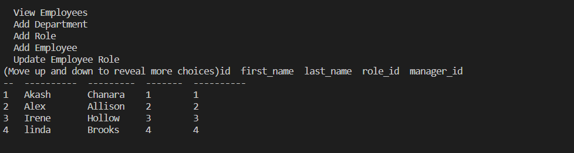

# Employee_database

# Description

Javascript is used by programmers across the world to create dynamic and interactive web content like applications and browsers. JavaScript is so popular that it's the most used programming language in the world, used as a client-side programming language by 97.0% of all websites

These interfaces are called content management systems (CMS). Your assignment this module is to build a command-line application from scratch to manage a company's employee database, using Node.js, Inquirer, and MySQL.

Walkthrough this Video[]

# Table of Content

1. [HomePage](#homepage)
2. [CaseStudy](#casestudy)
3. [CodeSnippet](#codesnippet)
4. [Tools](#tools)
5. [Prerequisites](#prerequisites)
6. [AuthorLinks](#authorlinks)

# HomePage



# CaseStudy

- GIVEN a command-line application that accepts user input
- WHEN I start the application
- THEN I am presented with the following options: view all departments, view all roles, view all employees, add a department, add a role, add an employee, and update an employee role
- WHEN I choose to view all departments
- THEN I am presented with a formatted table showing department names and department ids
- WHEN I choose to view all roles
- THEN I am presented with the job title, role id, the department that role belongs to, and the salary for that role
- WHEN I choose to view all employees
- THEN I am presented with a formatted table showing employee data, including employee ids, first names, last names, job titles, departments, - salaries, and managers that the employees report to
- WHEN I choose to add a department
- THEN I am prompted to enter the name of the department and that department is added to the database
- WHEN I choose to add a role
- THEN I am prompted to enter the name, salary, and department for the role and that role is added to the database
- WHEN I choose to add an employee
- THEN I am prompted to enter the employee’s first name, last name, role, and manager, and that employee is added to the database
- WHEN I choose to update an employee role
- THEN I am prompted to select an employee to update and their new role and this information is updated in the database

# CodeSnippet

```Database connect
const mysql = require("mysql2");
const inquirer = require("inquirer");
require("console.table");

const database = mysql.createConnection(
  // sql connect
  {
    host: "localhost",
    user: "root",
    password: "akash",
    database: "employees_db",
  },
  console.log(`Connected to database employees_db.`)
);
```

```Prompt
function promptInfo() {
  inquirer
    .prompt({
      type: "list",
      name: "option",
      message: "What would you like to do?",
      choices: [
        "View Departments",
        "View Roles",
        "View Employees",
        "Add Department",
        "Add Role",
        "Add Employee",
        "Update Employee Role",
        "Update Employees Manager",
        "Exit",
      ],
    })
    .then(function ({ option }) {
      switch (option) {
        case "View Departments":
          viewDepartment();
          break;
        case "View Roles":
          rolesView();
          break;
        case "View Employees":
          viewEmployees();
          break;
        case "Add Department":
          departmentAdd();
          break;
        case "Add Role":
          roleAdd();
          break;
        case "Add Employee":
          employeeAdd();
          break;
        case "Update Employee Role":
          employeeRoleupdate();
          break;
        case "Update Employees Manager":
          managerUpdate();
          break;
        case "Exit":
          database.end();
          break;
      }
    });
}
promptInfo();
```

# Tools

1. VsCode
2. Git (windows)
3. Github
4. MySQL2 package
5. Inquirer package
6. console.table package

# Prerequisites

Software need to be install

- Vscode
- git
- github(clone project)
- npm install

# AuthorLinks

[Github](https://github.com/akash2040/Employee_database)
